= LibTech1 Manual
:toc:
:toc-title:
// SPDX-License-Identifier: BSD-3-Clause

== What is this?

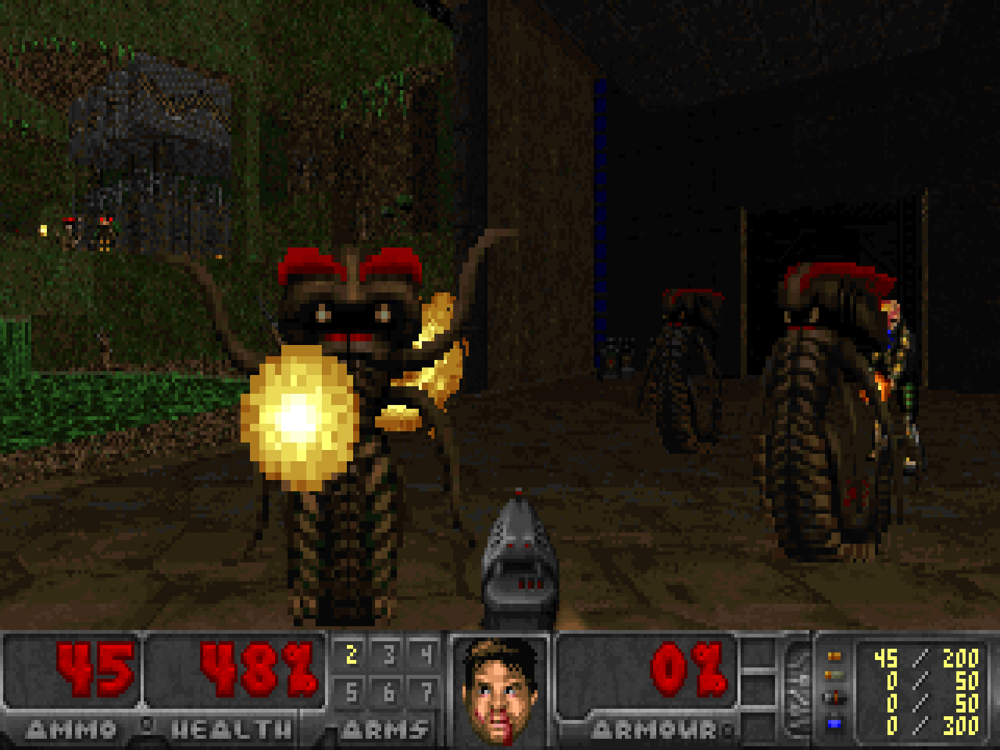

LibTech1 is a <<whythisfork,fork>> of https://freedoom.github.io/[Freedoom], a complete set of https://www.gnu.org/philosophy/free-sw.html[free/libre] and https://opensource.org/osd/[open source] game assets for the id Tech 1 engine. It is made available under the modified BSD license, meaning that anyone is free to share it, modify it and reuse parts of it subject to that licence's terms.

The game itself is a real-time first-person shooter (FPS). You explore a series of maps, in each one trying to find the way to the exit. An assortment of monsters will try to stop you, and you'll need to use weapons to defend yourself. Portions of the maps may be inaccessible until you find a particular key, or find a switch to open a passage. Gameplay will involve hidden-object exploration puzzles as well as real-time action puzzles about placing and timing the shots of your weapons.

Its name is a portmanteau of the word "libre" and "id Tech 1", the formal generic name for what is more commonly known as "the _Doom_ engine".

=== Open Sesame Nacho Libre BTS? What are you on about?

Imagine if the _Doom_ franchise got sold to some https://en.wikipedia.org/wiki/Venture_capitalist[VC] and they https://en.wikipedia.org/wiki/Enshittification[enshittified] every possible way to obtain the base _Doom_ games, but you still wanted to play https://en.wikipedia.org/wiki/Marine_Doom[Marine Doom] or any of https://en.wikipedia.org/wiki/Doom_modding#Megawads[these] or you even needed to demo the Harris Levels for a talk about the psychology of spree shooters or something. Freedoom is still going to be there for you--along with forks like this one.

A less concise but less flippant summary <<aboutfreedom,appears later in this manual>> as well.

<<<

[[installation]]
== How do you use it?

=== Installing and running

Since LibTech1 is only the assets of the game and not the code, you'll need to download a program to run it all. Any major "source port" (a program based on the original _Doom_ source code) that you can play Doom with will do.

The Doom Wiki https://doomwiki.org/wiki/Source_port[source ports page] has a comprehensive list of source ports The following are a good start:

* **https://www.chocolate-doom.org/wiki/index.php/Chocolate_Doom[Chocolate Doom]** strives to emulate the original _Doom_ behaviour as much as possible while providing an experience that works for people using modern machines. It is as close as you're ever likely to get to running the original DOOM.EXE without emulating DOS.

* **https://www.chocolate-doom.org/wiki/index.php/Crispy_Doom[Crispy Doom]** is based on Chocolate but allows lifting of some of the limits (view resolution, some physics behaviour, etc.) of the original program.

* **https://zdoom.org/index[GZDoom]** is a feature-rich gaming platform that can read Doom data files, designed for modern rendering hardware and extensive modding.

Each source port should ship with its own instructions, but the following steps will work for any of the above:

. Create a folder for all your Doom-related stuff if you haven't done so already.

. Take the following `.iwad` files from the distribution package and put them into this folder:

* `lt1-1.iwad` -- _Phase 1: Jailbreak_ +
A 36-map campaign split into 4 episodes. (Use this to run custom maps made for _Doom_ or _The Ultimate Doom_.)

* `lt1-2.iwad` -- _Phase 2: Judgment_ +
A 32-map fully contiguous campaign with an additional weapon and monsters. (Use this to run custom maps made for _Doom II: Hell On Earth_ or _Final Doom_.)

* `lt1-demo.iwad` -- _Demonstration of Power_ +
A 9-map campaign with only the assets needed to run the game at all. (This is not intended to be run with any mods or custom maps; it is not included in the main LibTech1 distribution and this demo version will not include the other two.)

. Put the source port's files into this folder, or install from your Linux repository.

.  _For GZDoom only,_ skip to the final numbered step in this list, then when GZDoom loads, go into the Options <<menus,menu>> and configure your <<controls,controls>> and other things. _(Protip: Display Options -> Texture Options -> Texture Filter Mode, "None (trilinear)". You're welcome.)_

. Navigate to this folder in the command line terminal, and enter one of the following to enter the setup program: +
+
  chocolate-doom-setup
  chocolate-setup
  crispy-setup
+
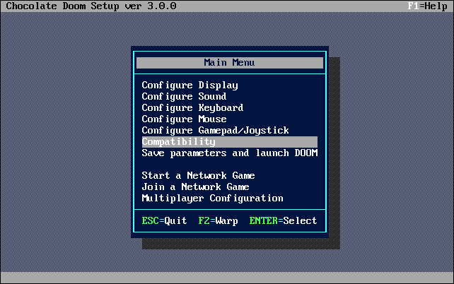

.  _For Chocolate Doom only,_ go into the "Compatibility" section and make sure "Vanilla savegame limit" is unchecked. (This feature emulates a crash in the original _Doom_ when you try to save on larger maps.)

. Bookmark this page of the manual and go down to the <<controls,Controls>> section. Read that section and see what you need, then configure the controls ("Configure Keyboard", etc.), resolution, etc., then save your changes, exit the program and proceed to the next step once done.

. Navigate to this folder in the command line terminal (if you haven't already), and enter the following command: +
+
  <source port> -iwad <iwad>
+
where _<source port>_ is `chocolate-doom` or `crispy-doom` and _<iwad>_ is `lt1-1.iwad`, `lt1-2.iwad` or `lt1-demo.iwad` as the case may be. (<<howtoplay,Choose `lt1-1.iwad` if this is your first time playing.>>)

When you see the title screen, press _Esc_ to bring up the game menu which can be navigated in the same way as the setup.

[[menus]]
=== Using the menus

Pressing the *Esc* key at any time opens a menu that will generally contain the following:

. <<newgame,**New game:**>> Start a new game.
. **Options:** View the options menu, which will vary significantly between source ports.
. <<savegame,**Load Game:**>> Load a saved game.
. <<savegame,**Save Game:**>> Save your current game.
. **Read This!:** View a help screen with the <<items,items>> you can pick up ingame.
. **Quit Game:** Terminate the program.

[[savegame]]
==== Loading and saving the game

"Save Game" brings up an array of slots for saved games. When saving, try to enter a recognizable description (e.g., "Map11 - Blue Key"). You can overwrite any slot at any time.

*Quicksave:* Pressing *F6* during play will bring up the "Save Game" menu appears as usual. After your first save this way, hitting F6 will save the game in the same slot, with the same name, bypassing all menu selection screens. Hit *F9* to quickload this saved game.

=== Keyboard shortcuts

The function keys replicate many of the menu functions (*bold* items are found deeper in the Options menus):

[cols="1,3",width="90%",align="center",valign="middle"]
|==========================
| **Esc** | <<menus,Menu>>
| **F1** | Read This!
| **F2** | <<savegame,Save Game>> 
| **F3** | <<savegame,Load Game>>
| **F4** | *Sound and music volume.*
| **F6** | <<savegame,Quicksave>>
| **F7** | *Exit to the title screen.*
| **F8** | *Toggle in-game messages.*
| **F9** | <<savegame,Quickload>>
| **F10** | Quit Game
| **F11** | *Cycle through brightness levels.*
|==========================

[[newgame]]
=== Starting a new game

To start a new game, choose "New Game" from the menu, or use the `-warp <map number>` parameter when you run your source port from the command line. (Separate episode and map number with a space for Phase 1.)

Phase 1's episodes are listed in chronological story order and increasing difficulty, but they do not need to be unlocked and you can choose any of them at any time.

[[skill]]
Skill level affects the placement and number of weapons, items, monsters and other objects (possibly including even the player starts); the two extreme settings will also change the way the game behaves. This cannot be changed mid-game.

. **Learning the Controls:** Easy, except ammo pickups give you twice the ammo and all the damage you take is halved.
. **Business Casual:** Easy skill level.
. **Free to Play:** The default, medium skill level.
. **No Holds Barred:** Hard skill level.
. **Obsessed:** Hard, except that monsters are twice as fast and attack much more aggressively, and each killed monster resets after about 40 seconds. <<cheats,Cheat codes>> are disabled. Ammo pickups give you twice the ammo. Most maps are not balanced for this.

The following command line parameters can be combined with the above `-warp`:

* `-skill <number>`: sets the skill level as above.
* `-fast`, `-respawn`: give you Obsessed-style fast and respawning monsters respectively, regardless of skill level, without the other features of the actual Obsessed setting.
* `-nomonsters`: does not spawn any monsters at all.

==== A shortcut

From the title screen before any menu is displayed, you can just keep pressing Enter to open the menu, select the default option on everything that appears, and thereby start a new game on the medium skill level.

<<<

[[howtoplay]]
== How to play: the basics

[[controls]]
=== Controls

Please take some time to review the controls below and go into your source port's setup program (or options menu in GZDoom) accordingly. These descriptions assume keyboard and mouse but you can adapt them to whatever controller you are using as long as your source port supports it.

**Doom's defaults are widely considered suboptimal;** check your source port for how to reconfigure them. The most common options are provided as starting recommendations but there is no one "best" solution that works for everyone--you may need to experiment.

* *Move/"Strafe":* Move forward, backward, left, and right.
** _Default:_ Up/Down and ,/.; vertical mouse movement; Mouse2 for forward.
** _Recommended:_ Put your non-mouse hand on the keyboard naturally. Try pressing four keys as though you were moving a cursor around using those keys. Assign those keys to forward, backward, left and right.
*** Conventionally *W, S, A and D* are used, as the furthest-left letters on a QWERTY keyboard that are placed similarly to arrow keys.

* *Turn:* Turn around and look at things and aim your weapon.
** _Default:_ Left/Right; horizontal mouse movement.
** _Recommended:_ Mouse movement, but you may want to *set the mouse sensitivity using the setup program* rather than the in-game options menu, as for historical reasons the latter may not go as high as you need.
*** Some source ports let you have modern FPS behaviour in which vertical mouse movement makes you look up and down.

* *Fire:* Hold this down to have your character discharge the weapon shown in the main view.
** _Default:_ Ctrl; *Mouse1.*
** _Recommended:_ Whatever you can most easily hold down while moving and turning at the same time.

* *Use:* While facing a door or switch, hit this button to attempt to use the switch or open the door. Also used to restart a map (or respawn in multiplayer) if you die.
** _Default:_ Space.
** _Recommended:_ Anything you can easily reach and remember. On WSAD setups this is usually *E*, since Space is now typically used in other FPS games for jumping.

* *Run:* Hold this down to move at double speed (or regular speed if you've enabled the "Always Run" function).
** _Default:_ *Shift.*
** _Recommended:_ Whatever you're comfortable holding while moving and turning, but it may be good to *enable "Always Run"* in the setup program because there is no fatigue in this game and the only reason to go slower is for the occasional need for slower, precise movement.

* *Switch Weapons:* Doom's 9 different weapons all have distinct roles--you will need to switch to specific ones and not just keep firing until you auto-switch when the ammo for that weapon runs out.
** _Default:_ *Number keys;* mouse wheel in some source ports to cycle through available weapons.
** _Recommended:_ It's best to leave the number keys as they are, since documentation and mods will frequently organize and refer to weapons using the corresponding slot numbers. Nearly all source ports, however, will provide an option to cycle through whatever weapons you have: use whatever you want, if anything at all, since Doom's weapon switching animation is so slow the additional hand movement time for an awkwardly placed key makes minimal difference.

You may notice a "Strafe On" button which when held down turns your turning input into sideways movement. Some might find it helpful to use the mouse for extra movement precision--or if all the enemies are coming from one direction and you want to treat it like a vertical shmup.

==== Vertical aiming

If you have a monster, a barrel or a PvP opponent crossing the middle of your display when your weapon discharges, the game will adjust your vertical aim for you. Some source ports will let you disable this behaviour and aim manually instead.

<<<

=== A tutorial

This tutorial will introduce you to every basic action you need to play and beat all of LibTech1.

Start a new game in Phase 1, Episode 1 on easy and follow the steps. Skip anything that bores or confuses you, and redo anything you find challenging as long as you like.

.Your starting view.
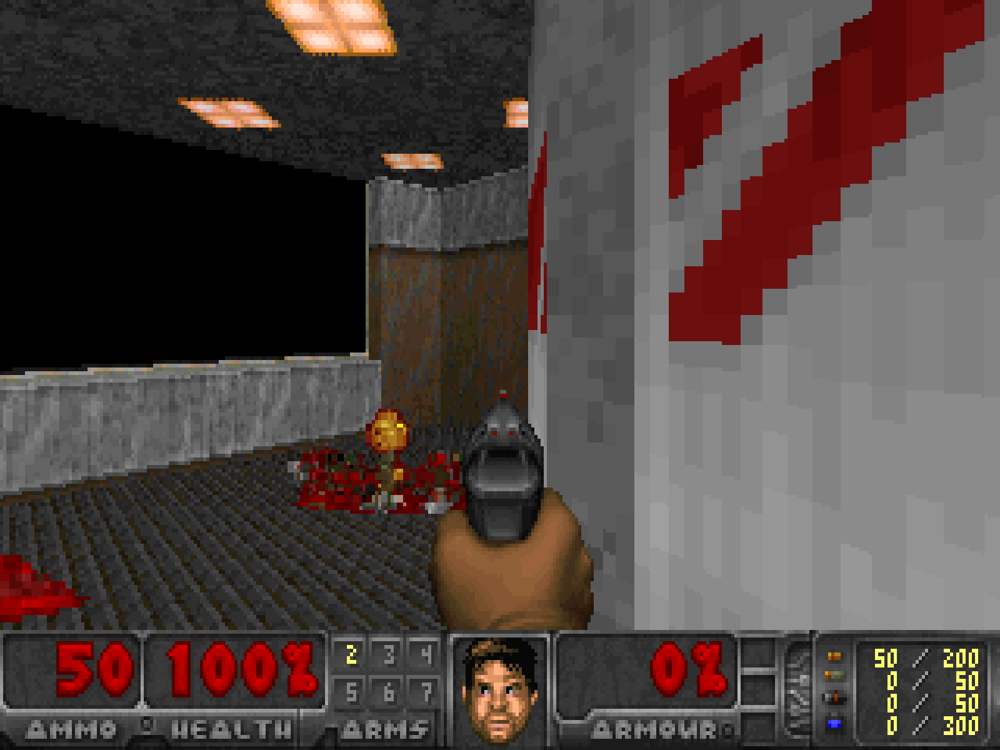

==== Moving
* Tap your forward, right, left and back buttons and watch how your view changes.
* Note how things can block your movement.
* Try moving right into that <<powerups,wiggling, bulbous, orange thing>>. It brings your <<health,health>> up by 1 point when consumed.

==== Turning
* Press one of your left or right keys to turn left or right.
* Try to turn one entire circle. Go at your own pace, stopping or reversing to look at anything whenever you want.
* Do it again with the mouse or other controller. Move a little bit as you go, and watch how that changes the perspective and how sideways movement can help you see how long a wall or how far away an object is.
* Wander around inside the room looking at things, getting used to turning and moving at the same time. There's a secret in here but it is not included in the tutorial--try to guess what it might be, but don't worry about it for now.

==== Using things
* Move through the broken doorway. At the end of the brown corridor you will find:
** a grate revealing the larger area beyond; and
** a wall section with warning stripes on the bottom.
* The latter is a door. Move up to it, face it, and press Use.
* Move through the doorway and turn right. You will see another object with warning stripes, this time with a <<keys,fringe showing what key it needs>>. Try using it--it won't work because you don't have the horizon key yet.
** Not all doors look like this. When in doubt, walk up to anything distinct-looking on a wall and press Use.

.The first door you can open.
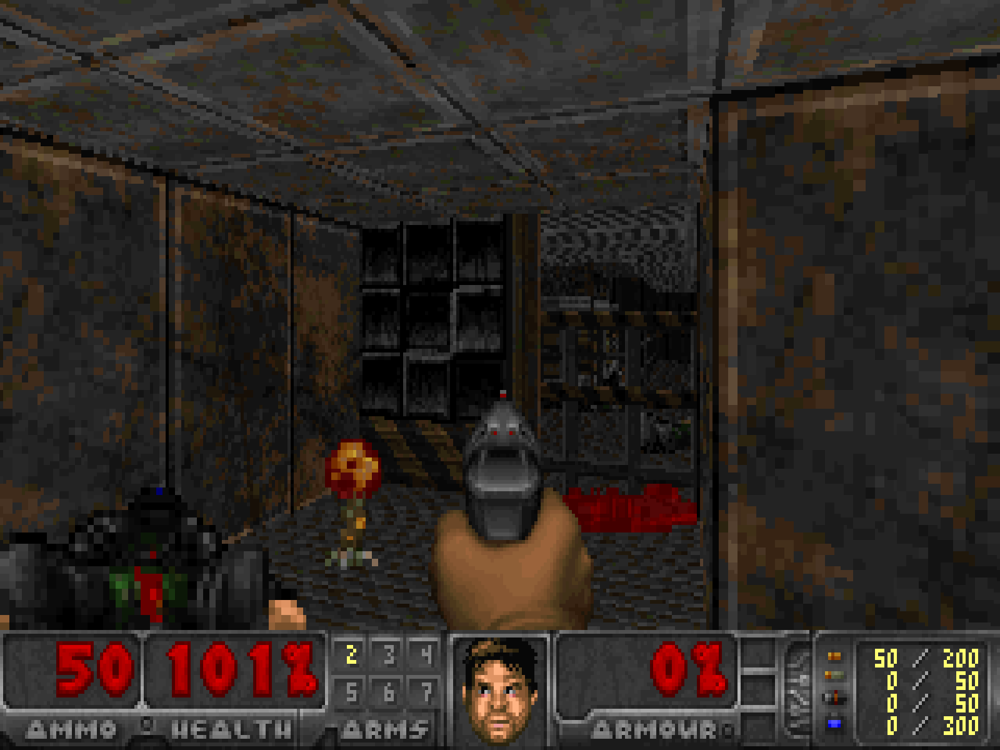
.The first (non-secret) door you can't open. For now.
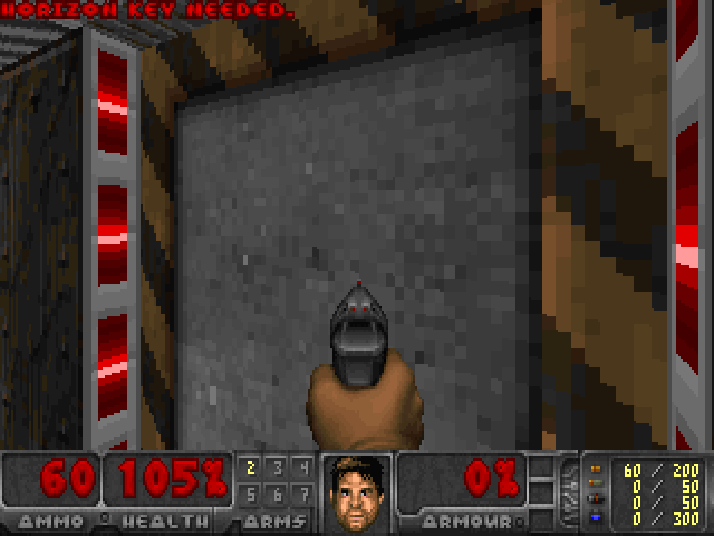

==== Aiming and taking cover
* Go down the stairs and look a little to your left. At the bottom of the raised wall you will find a line of barrels.
* When you're at the bottom, turn so that your gun is pointed directly at the foremost barrel.
* Now try moving to the left, so that the barrels are just barely out of sight.
* Alternate between the two positions. Don't turn too much, but try to make sure that every time you're in view of the barrel your gun is pointed directly at it.

.Peek-a-boo!
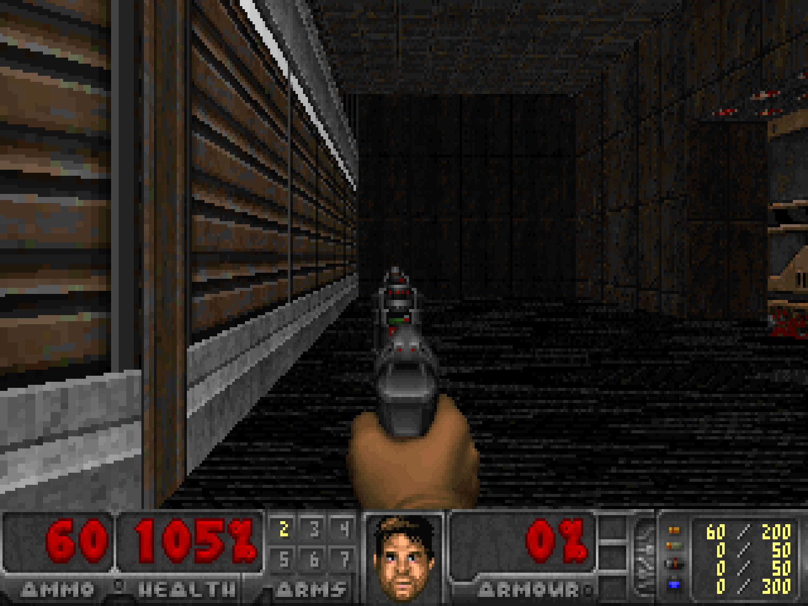
.Where's mommy?
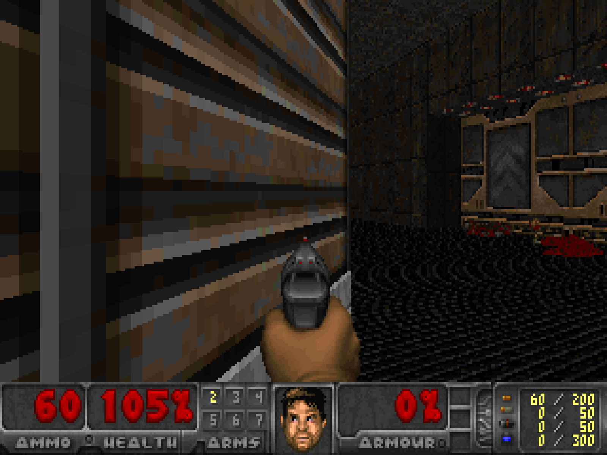

==== Shooting (and saving)
* Press *F6* and <<savegame,quicksave>> your game.
* Step out to face the barrel as before, but stop. Tap the Fire key once to shoot a single bullet. It should land dead center where you're aiming. Note how the barrel moves slightly when hit--all shootable actors get knocked around a bit when taking damage, including you!
* Now take a few steps back and _hold_ the Fire key to fire in rapid succession. Note how your shots go everywhere; eventually though the barrels will all explode. Good job!
* Hit *F9* so you're back how you were before the shooting began. Face the barrel and take a few steps back as before, but this time take single shots--that is, tap the Fire key and do not touch it again until the pistol firing animation has _completely_ finished. Note how it takes longer between shots but every shot should hit the barrel. The damage is random but it normally takes 2-3 hits to explode.

."We're going to shoot all these barrels without wasting a single bullet..."
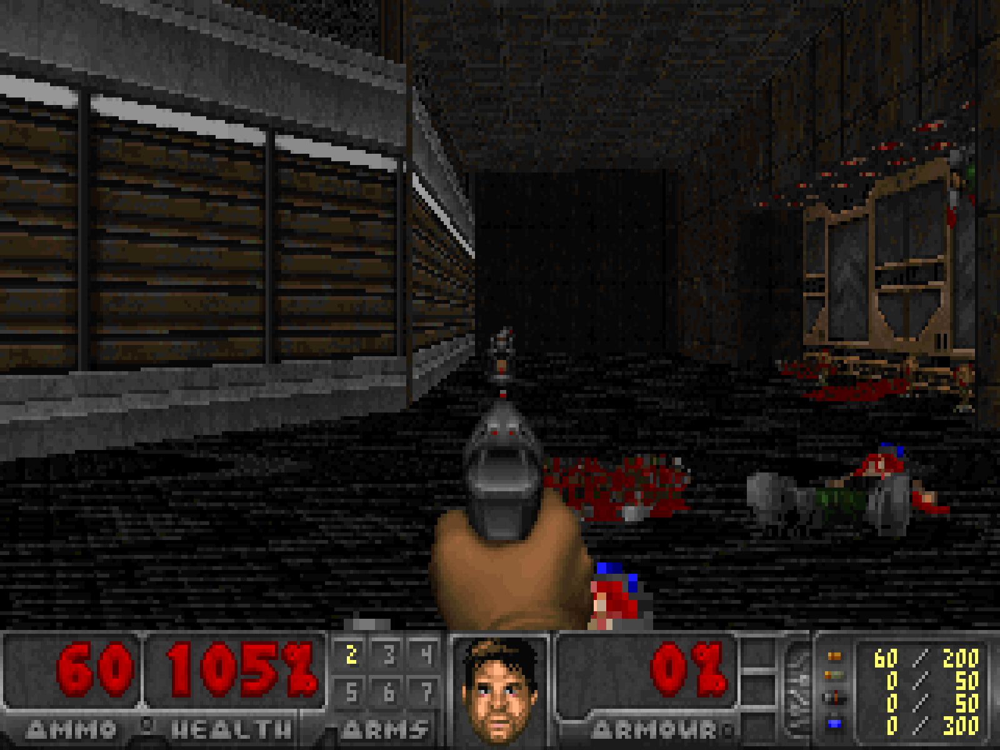

==== Shooting and taking cover
* Hit *F9* again and try the same shooting stuff as before, both rapid and single shots, except:
** Get a bit closer and be alternating positions the whole time, like we were doing with "Aiming and taking cover".
** Try to keep the barrels visible only for as long as necessary for you to hit it. If you can time it _really_ well you can start pressing Fire right before the barrel comes into view and the gun will go off just in time.
** Try this with both sustained fire and single shots. Reload the game as often as needed or desired.
* The ideal is _not_ to see the explosion.

."Stupid gun!"
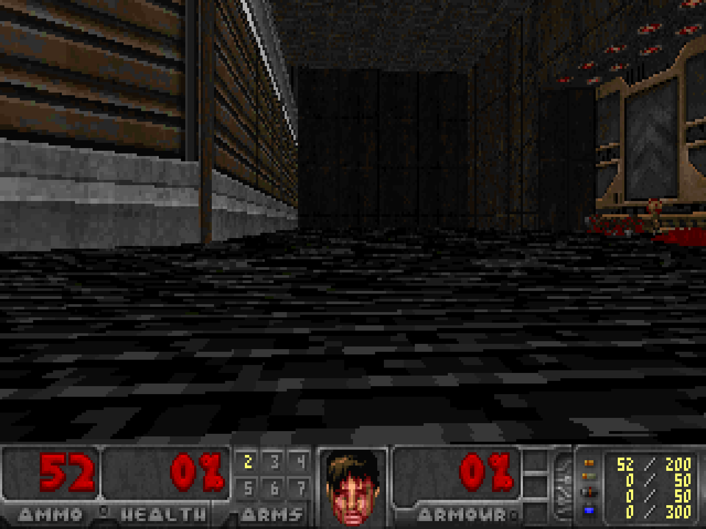

==== Shooting at vertically offset targets
* Hit *F9* again and go back up the stairs.
* Shoot at the back wall to the right of the line of barrels.
** Note how the bullet puff appears on the same level as where you are pointing.
* Shoot at the rearmost barrel.
** Note how even if you miss slightly the bullet puffs will appear at the correct vertical level.
* Reload as necessary to experiment to see how sustained fire interacts with this.

.The vertical auto-aim only kicks in if you're closer than a certain distance. This screenshot is just barely within range.
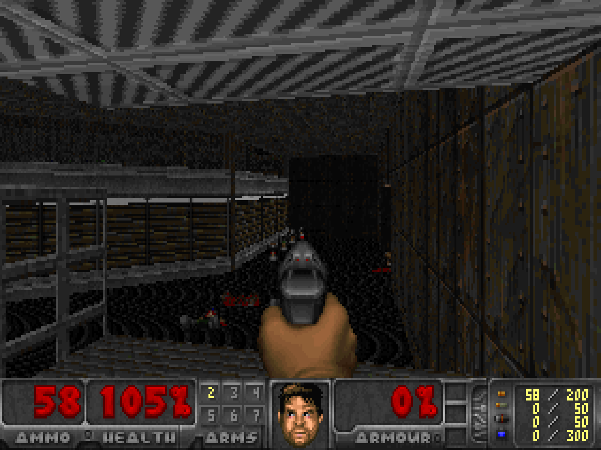

==== Your first mission
* Hit *F9* again to avoid wasting ammo.
* Turn left and make a right just past that big elevator. Stop when you hear the growls and see the movement.
* Take cover behind the elevator. Move back into view to shoot the <<enemies,zombies>>--just like we were doing with the barrels before, except they don't conveniently blow each other up when they die so you have to do it for all of them.
** Also unlike the barrels, the zombies will change position, which means you may need to improvise new spots to retreat to for cover. Think fast!
* Once everything up on the catwalk is no longer moving, move further in and turn right. You will find some <<health,medical pickups>>; take whatever you feel you need.
* Move back upstairs and follow the railing on the catwalk until you get to where the zombies had been. Inside the very last cell, just barely reachable from outside, is the horizon passcard. Move into it to pick it up. You now have full access to all the cells in this cell block--as well as that fringed door we saw earlier.

.They're a little easier to see when they're moving ingame.
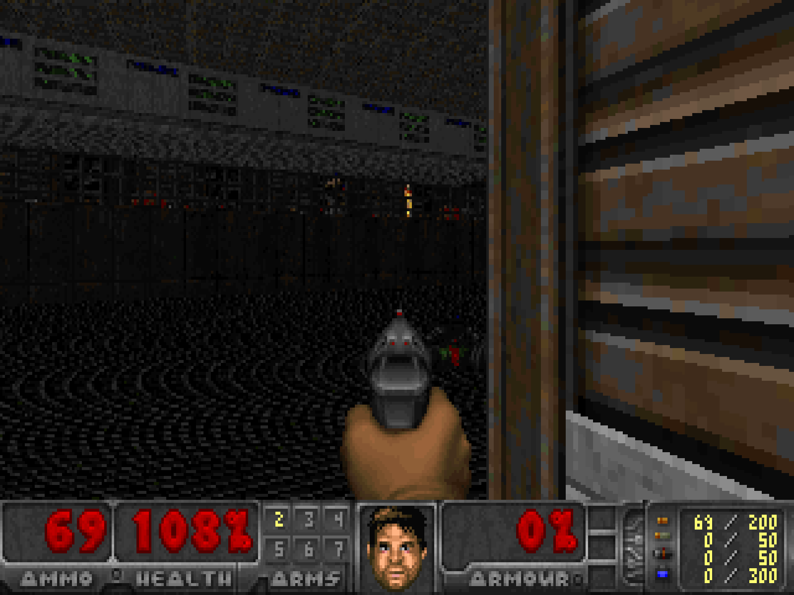

==== Continuous moving fire ("Shoot it until it dies")
* Return to that fringed door. Open it to reveal a switch.
* Hit *F2* to save a new slot. (Hit *F3* later to load this new save.)
* Press Use to hit the switch and move down the stairs.
* Move towards the elevator. As it descends it will reveal what's been causing all that fucked-up murmurin' this whole time: a flesh worm. It doesn't have a gun but it does have extra hitpoints to help it get into biting range before you can kill it--unless you can move away first.
* Let it move towards you while you constantly move to keep it a safe distance from you.
* Think back to when you were practising sustained fire and how far off target the bullet puffs appeared. As you move, try to keep a distance so that the flesh worm always takes up that much of the center your view.
* Once you've gotten the hang of doing that, keep doing it with the Fire key held down until it stops chasing you.

.Maybe a little too close...
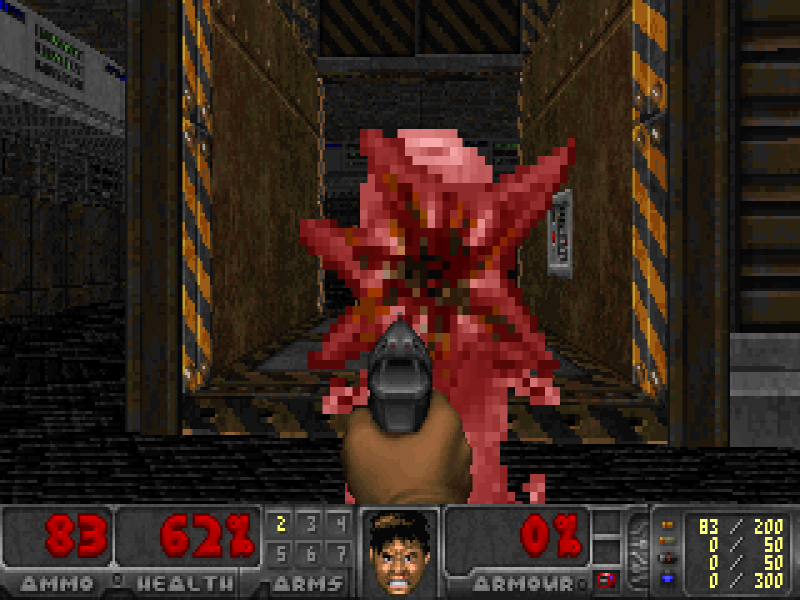

==== Conclusion
* Pick up any remaining items you find and step onto the elevator. Use the switch to go up.
** Don't bother with the switch you see on top, it just brings the elevator back down.
* Head down the catwalk until you reach the door. Save if you want--the next firefight's going to be a good deal tougher.

Congratulations! You now know everything you need in order to beat Freedoom--aiming, shooting, taking cover, using doors, using switches, using lifts, grabbing pickups, [.line-through]#savescumming# and circlestrafing! You can probably close the manual at this point and just figure out the rest as you go, but if you want spoilers for more nitty-gritty game mechanics (or the cheat codes) feel free to read on.

<<<

== How to play: the details

=== The status bar

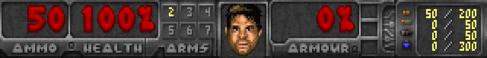

At the bottom of the screen, you'll see the status bar, which is divided into
the following sections:

. **Ammo:** Number of units of <<ammo,ammunition>> remaining for the current
weapon.
. **Health:** How many more points of damage you can sustain before you have to restart or reload.
. **Arms:** Which weapons you've found so far. Check out the
<<weapons,weapons section>> for more information.
. **Mugshot:** "Your" reflection. Shows overall health and will look in the direction of where you've been hit.
. **Armour:** The more armour you have, the less your health will suffer if
you're injured. See the <<armour,armour section>> for more information.
. **Ammo:** How may <<ammo,bullets, shells, missiles and polaric energy units>> you have, respectively, along with the maximum of each you can carry.

Despite being expressed as percentages, the health and armour counts are actual literal point counts for the player. Good to keep in mind when comparing damage with monsters.

[[items]]
=== Items

Within the game you'll encounter various collectible items: <<weapons,weapons>>, <<ammo,ammunition>>, <<health,health>>, <<armour,armour>> and some <<powerups,power-ups>> which give you special abilities. At some point you may also be called upon to secure a <<keys,key>> or two in order to progress.

To try to pick something up, simply move into it. A flash, sound and confirmation message will happen on success. Failure means you have the maximum you can carry for that item (including some weapons in multiplayer, regardless of ammo) and it's not one of those <<powerups,special items>> that you need to pick up to get a perfect item score for that map.

If you pick up an item that gives you more than you can carry, the difference is lost. Tread carefully.

[[weapons]]
==== Weapons

You start the game with only a handgun, 50 bullets and your fists. Exploring the map will reveal more weapons and ammo that you can pick up and use.

Pressing the number key on the keyboard switches to the given weapon if you have it. Each ranged weapon consumes one of four types of ammo.

1. _Melee_
* *Fist:* The ammo... is you. +
Does 1d10*2 damage per hand caught.
*  *Ripsaw:* The tool does not know wood from flesh. Each tooth hits for between 2 and 20 damage. +
Press 2 again to switch back to fist, but only while under the influence of the strength symbiote.
2. _Sidearm_
* image:../sprites/pista0.png[Handgun] *Handgun:* Your starter weapon. Its main purpose is to let you fight your way to a better weapon, and to hit shootable switches without wasting a second bullet. +
Uses 1 bullet per shot. All bullets do 1d3*5 damage each.
3. _Assault_
* image:../sprites/shota0.png[Warp Blaster] *Warp Blaster:* AGM stopped support for chemical propellant shotguns years ago. Shoots seven pellets in a randomized fan pattern, letting you hit multiple targets. +
Uses 1 shell per shot.
* image:../sprites/sgn2a0.png[Fulminating Warp Blaster] *Fulminating Warp Blaster:* Synergizing warp core alternation technology iteratively teleports almost half the pellets shot for a total of 20 impacts, but across a much wider spread. Expensive to produce, the F.W.B. is not entrusted to the rank and file and can only be found stored in certain locations. _Only available in Phase 2._ +
Press 3 again to switch between warp blasters. +
Uses 2 shells per shot; cannot use only one.
4. _Rapid response_
* image:../sprites/mguna0.png[Minigun] *Minigun:* Handgun but fast and good. _Both_ shots from an initial 2-round burst are perfectly precise! +
Uses 1 bullet per shot, but always tries for doubles.
5. _Explosives_
* image:../sprites/launa0.png[Missile Launcher] *Missile Launcher:* Don't get caught in the blast! +
For safety reasons, you must release Fire after the weapon finishes switching before you can fire. +
Uses 1 missile per shot, each doing 1d8*20 damage + _n_ damage to all valid targets in a 128-pixel radius, _n_ being 128 in the middle and diminishing with distance.
6. _Heavy Weapon_
* image:../sprites/plasa0.png[Polaric Energy Weapon] *Polaric Energy Weapon:* An experimental machine gun based on poorly understood meta-hyperspatial principles reverse engineered from the workings of the Polaris Artifact, tentatively dubbed the _energeia Polaris_, or "polaric energies". +
Uses 1 energy per shot for 1d8*5 damage each.
7. _Superweapon_
* 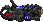 *Polaris Artifact:* An ogre's weapon, wielded by gentlemen of a nobler age. Launches a single massive polaric energy projectile, the explosion of which triggers a secondary energy blast from your position in the same direction! Slow to shoot, but worth the wait. +
Uses 40 energy per shot. Direct hit does 1d8*100 damage; blast consists of 40 shots of 15d8 each.

[[ammo]]
==== Ammo
[options="header",cols="1,1,1",width="70%",align="center",valign="middle"]
|==========================
| Ammo type | Small | Large
| Bullets |
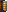 x10 |
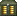 x50
| Shells |
image:../sprites/shela0.png[Shotgun Shells] x4 |
image:../sprites/sboxa0.png[Box of Shotgun Shells] x20
| Missiles |
image:../sprites/rocka0.png[Missile] x1 |
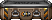 x5
| Energy |
 x20 |
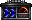 x100
|==========================

Monster-dropped weapons provide one small pickup's worth of ammo, map-placed weapons two.

The *backpack* 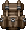 gives one small pickup's worth of every ammo type. Once you have picked one up, you can carry twice as much ammo as normal for the rest of the game.

[[health]]
==== Health

If you have been injured, you may be eligible to pick up a health refill. The small ones image:../sprites/stima0.png[Small Health Refill] restore 10 points, and the large ones image:../sprites/media0.png[Large Health Refill] 25, to a maximum of your starting 100%.

[[armour]]
==== Armour

You start with 0% armour. Picking up a force field vest 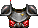 will get your armour up to 100% immediately.

Regular armour absorbs *one third* of damage you receive, rounded down. If you are hit for 50 damage at 100 health/100 armour, you'll lose 16 armour (50/3=16.666...) but only 34 health.

Picking up an attuned force field armour 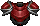 will bring your armour up to 200%, and will cause your armour to absorb *half* the damage you receive instead of one third. This effect lasts until the armour reaches zero or is replaced with a . (The latter can happen as soon as your armour count dips to 99 or below. Tread carefully.)

[[powerups]]
==== Powerups

* _Bonuses_
**  **Ectoplasmic Replete** +
Little is known about these barnacle-like creatures which sprout like mushrooms wherever there is energy of pain and death. The yellow ooze in their sporophores spreads through the body to numb pain and reverse age and damage to living tissue--even those inflicted in the future. Consuming one gives you 1 point of health, up to a maximum of 200%.
**  **Force Field Emitter** +
An optional amplifier for many improvised teleportation networks used by the monsters. Absorbing the power of one into your own suit gives you 1 point of armour, up to a maximum of 200%.
* _Utilities_
** image:../sprites/pvisa0.png[Low-Light Goggles] **Low-Light Goggles** +
Reveal everything at full illumination for 2 minutes.
** image:../sprites/pmapa0.png[Area Survey Map] **Area Survey Map** +
Reveals unexplored areas of the current map, including some secret areas that may not be immediately visible.
** image:../sprites/suita0.png[Rescue Operations Suit] **Rescue Operations Suit** +
Protects you from heat, toxins and radiation from damaging floors for 1 minute.
** image:../sprites/pinsa0.png[Invisibility Cloak] **Invisibility Cloak** +
Makes you almost invisible for 1 minute. Monsters still detect your presence, but they'll find it much harder to aim. A mixed blessing against projectiles.
** image:../sprites/pstra0.png[Strength Symbiote] **Strength Symbiote** +
Instantly restores your health to 100%. As a side effect, your fists do ten times their usual damage for the rest of the map.
* _Temporal Bubbles_
** image:../sprites/soula0.png[Ectoplasmic Surge] **Ectoplasmic Surge** +
Like an ectoplasmic replete forced rhubarb. Gives you 100 points of health, up to a maximum of 200%.
** image:../sprites/megaa0.png[Negentropic Surge] **Negentropic Surge** +
Maxes you out to 200% health and armour.
** image:../sprites/pinva0.png[Vanguard Device] **Vanguard Device** +
Makes you immune to all damage for 30 seconds, allowing you to get past overwhelming defences.

[[keys]]
==== Keys and Objectives

To pass through some areas you may need to possess a passcard, or one of the retrievable McGuffins that constitute your mission objectives for that map. There are up to 3 classes you may need:

* *Midnight:* The dormant sun beneath the waters of the world-disc. +
*Pickups:* image:../sprites/bkeyb0.png[Midnight Passcard]
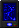 
*Door patterns:* 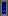
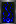 +
_Circles, waves, bottom, blue._

* *Zenith:* The triumphant sun shining down from its height. +
*Pickups:* image:../sprites/ykeyb0.png[Zenith Passcard]
image:../sprites/yskua0.png[Lore-Stone] 
*Door patterns:* 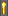
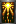 +
_Cruciform sunburst, rays, top, yellow._

* *Horizon:* The liminal sun at dawn or dusk. +
*Pickups:* image:../sprites/rkeyb0.png[Horizon Passcard]
image:../sprites/rskua0.png[Biotic Sample] 
*Door patterns:* 
 +
_Horizontal lines, middle, red._

Some maps for advanced sourceports may distinguish objectives from passcards. If the objective is specifically required over the passcard, the larger pattern is typically used, and vice versa.

<<<

Here is how the different key icons appear in the status bar:

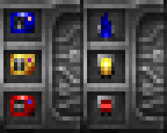

=== Using the map

Hit the Tab key during play to bring up the map.

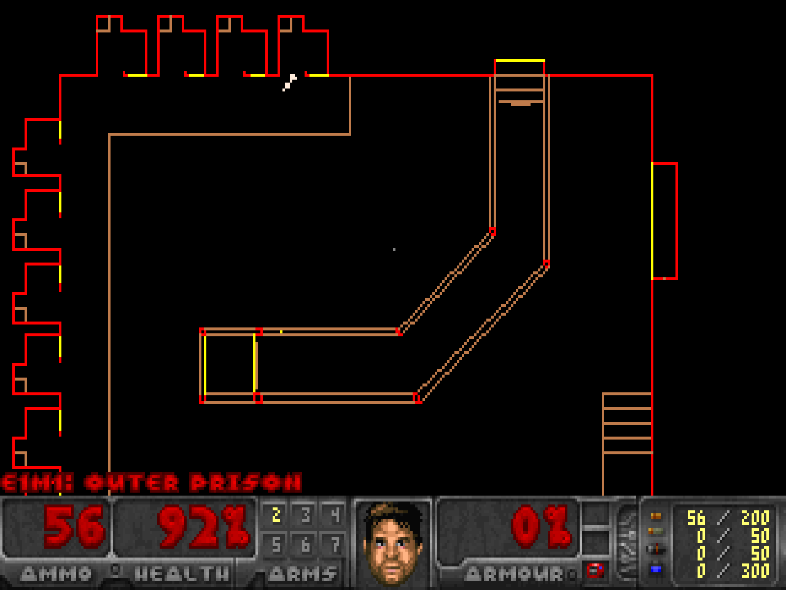

<<<

Areas of the map are colour coded as follows:
[frame="none",cols="3,8",valign="middle",align="center",width="100%"]
|==========================
| **White** | Your position. The arrow points where you are facing.
| **Red** | Walls (or possibly secret doors).
| **Yellow** | Changes in ceiling height, including doors.
| **Brown** | Changes in floor height (e.g., steps).
| **Grey** | Undiscovered areas (not normally shown, but may be revealed if the <<powerups,Area Survey Map>> item is discovered).
|==========================

While looking at the map your movement and shooting work as usual, but with additional controls:

[frame="none",cols="1,6",valign="middle",align="center",width="80%"]
|==========================
| **Tab** | Toggle map.
| **-** | Zoom out.
| **+** | Zoom in.
| **0** | Maximum zoom out.
| **F** | Toggle whether the map follows the player or can be browsed with the cursor keys. _(EDSF players may want to change the key for this.)_
| **G** | Toggle map grid.
| **M** | Add a map bookmark at the current location.
| **C** | Clear all bookmarks.
|==========================

[[enemies]]
=== Enemies

Here's a roster of cybernetically zombified henchmen who have no goal apart from killing you. An asterisk (*) marks monsters that only appear in Phase 2.

[frame="none",cols="3,1",valign="middle",grid="none",align="center",width="100%"]
|==========================
| **Goon** +
HP: 20 +
Damage: 1d3*5 +
_"Stay Connected. Stay Human.™"_ Who knows what that algorithmic firehose of AGM slop being fed into their always-online neural implants is telling them about you. Drops a bullet clip when killed. |
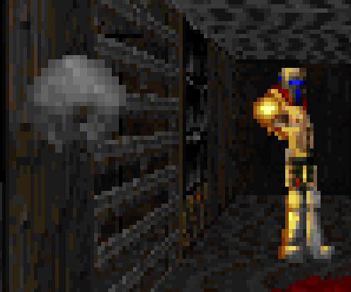
| **Henchman** +
HP: 30 +
Damage: 3x 1d3*5 +
The way these lowlifes handle their weapons shows why they're never entrusted with F.W.B.s, but they can still definitely hurt you and everyone around them. Drops a warp blaster when killed. |
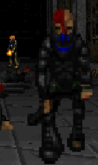
| **Stormtrooper*** +
HP: 70 +
Damage: 1d3*5 continuous stream +
Once they lock on, they'll hold down the trigger until their target is dead or out of sight, or they get hit hard enough to distract them. You will need cover--or something to hit them really hard. Drops a minigun when killed. |
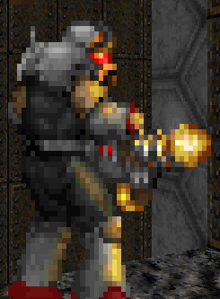
| **Serpentipede** +
HP: 60 +
Damage: 1d8*3 +
You've heard that Earth was officially at war, but you've never seen a "specimen" throw a fireball at someone outside of AGM Colonial News. Incidentally, most species lack the quirks of Terran neurology that require the obvious headpieces for total neural implant sensory immersion. |
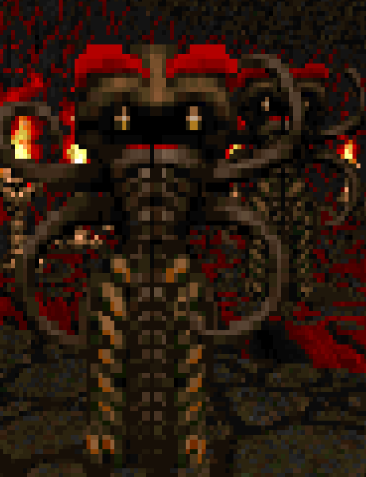
| **Flesh Worm** +
HP: 150 +
Damage: 1d10*4 +
Attack at close range and can take up to three warp blaster shots to neutralize. They're pretty clumsy, but some of them can bend light around themselves and become partially invisible--watch for the shimmer. |
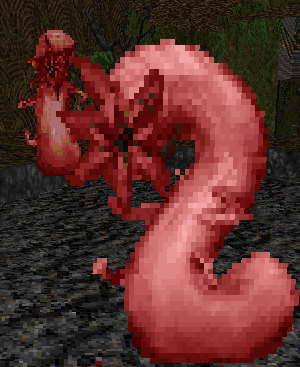
| **Trilobite** +
HP: 400 +
Damage: 1d8*5, 1d6*10 melee +
Their three-lobed eyes double as capacitors for shaping and launching ball lightning that just turns into a big, invisible, noticeably more damaging zap on contact if you get too close. |
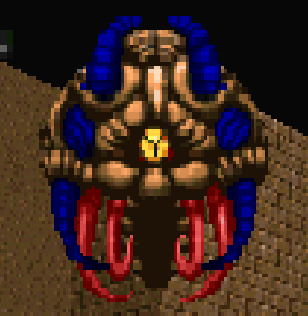
| **Hatchling** +
HP: 100 +
Damage: 1d8*3 +
The larvae haven't learned to control ball lightning yet, so they just charge at you. |
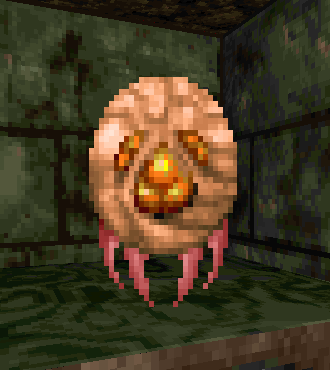
| **Matribite*** +
HP: 400 +
Damage: _<no direct attack>_ +
Spit hatchlings like fireballs and whatever happens, happens. Weaponized permissive childrearing at its worst. |
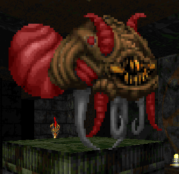
| **Pain Lord*** +
HP: 500 +
Damage: 1d8*8, 1d8*10 melee +
Dimension-hopping cultists that worship nuclear slime or something; don't let them baptize you in it. Their 1000-hitpoint golden ringleaders _do_ appear in Phase 1. |
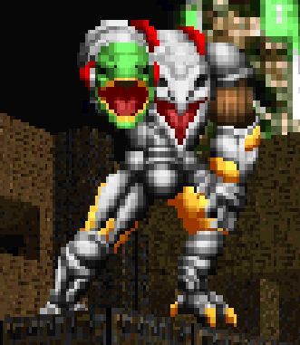
| **Octaminator*** +
HP: 300 +
Damage: 1d8*10, 1d10*6 melee +
Their homing fireballs are the second strongest projectile in the game, but they'd rather use their speed to close the distance and beat the shit out of you up close. |
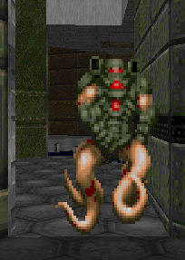
| **Necromancer*** +
HP: 700 +
Damage: 20 + 70 explosion +
An ancient being with the power to reverse time itself for its chosen fallen--or blast you to smithereens with the force of primordial earth and fire from below. |
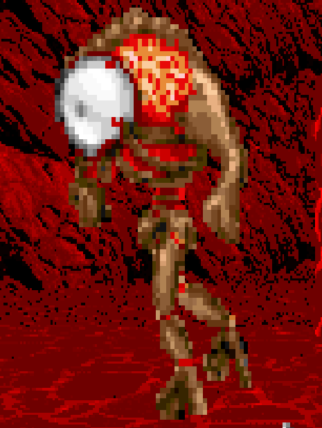
| **Manticore*** +
HP: 500 +
Damage: 1d8*5 continuous stream +
A militant cult of cybernetic mercs that never leave home--or stay home--without their high-capacity polaric energy support weapons. |
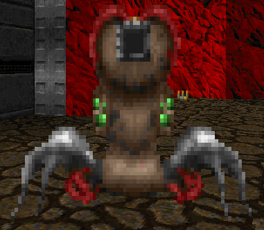
| **Chimera*** +
HP: 600 +
Damage: 2x 1d8*8 +
Nasty, brutish law enforcement genetikonstructs fitted with long distance flame throwers for crowd control and area denial. All chimeras are bastards. |
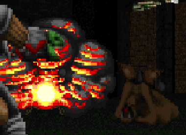
| **Warp Ganglion** +
HP: 3000 +
Damage: 3x 1d3*5 continuous stream +
Vat-grown machine-minds built for the impossibly complex calculations needed to control interstellar teleporters. Their telekinetic manipulator doubles as a warp blaster that can fire nonstop for hundreds of shots. Immune to explosions. |
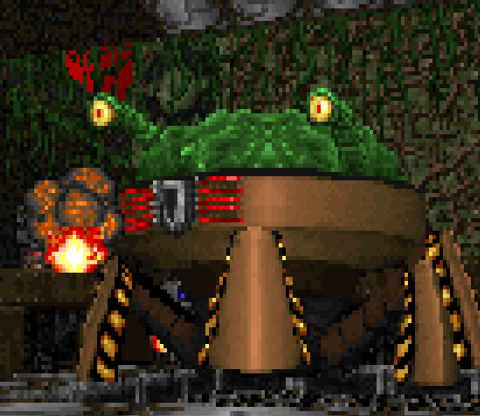
| **Naphil** +
HP: 4000 +
Damage: 1d8*20 + 128 explosion +
The love children of apocalyptic technological accelerationism and military-industrial derangement, the nephilim are fast, heavily shielded and equipped with a missile launcher equal to your own. Immune to explosions. |
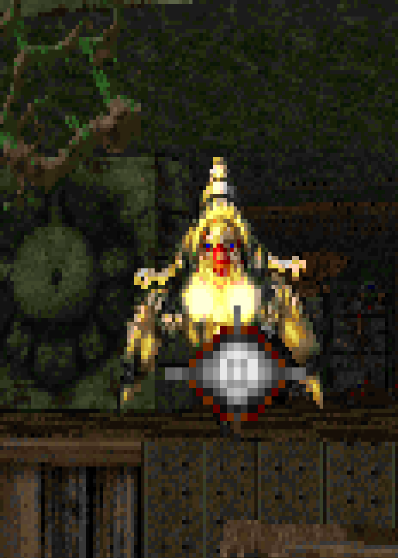
|==========================

<<<

While not enemies, the following can also be shot:

[frame="none",cols="3,1",valign="middle",grid="none",align="center",width="100%"]
|==========================
| **Explosive Barrel** +
HP: 20 +
Damage: 128 explosion +
Pressurized canisters of the energized sludge that runs the world. Can blast anything in their vicinity--monsters, other barrels, or you! |
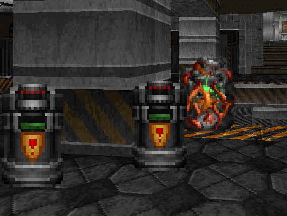
| **Larval Specimen*** +
HP: 100 +
Damage: _<does not attack>_ +
It's not clear why these lizard baby things are imprisoned like this, but you can free them by shooting down the tubes. Freeing all of them on a map usually opens up a path somewhere. |
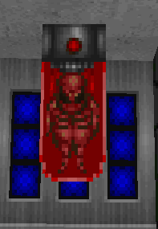
|==========================

=== Environmental hazards

Even without monsters the map itself can kill you:

[frame="none",cols="7,3",valign="middle",grid="none",width="100%"]
|==========================
| **Damaging Floors:** Lava, radiation, teleporter sludge, flesh-eating _songreel_ blooms, you name it. A <<powerups,rescue suit>> helps, but is limited by time--and the strongest damage still trickles in a little. |
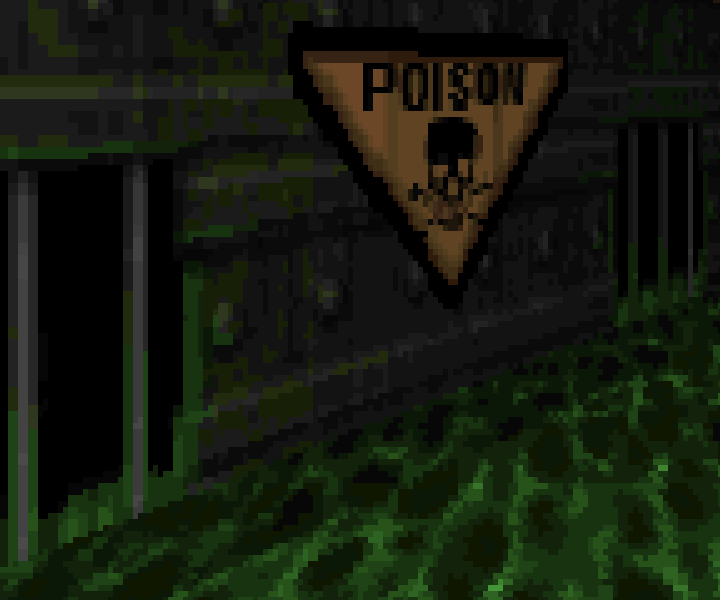
| **Crushing Ceilings: ** These moving ceilings are often placed above high-traffic areas and tempting-looking items. Be careful not to get caught beneath one! |
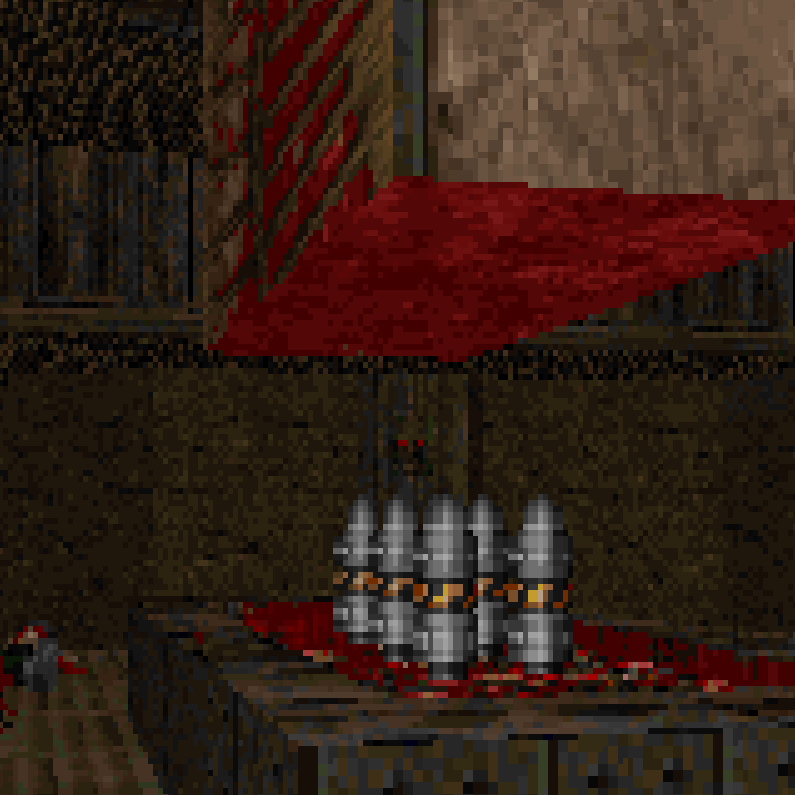
|==========================

<<<

=== Dying

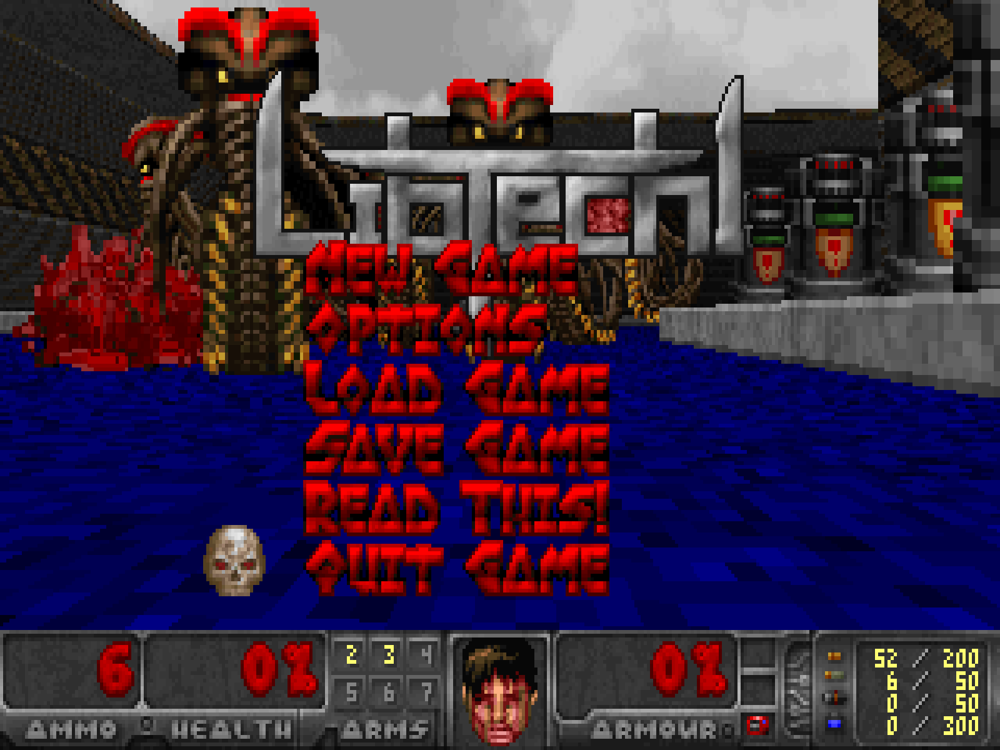

Eventually you will get into a situation you can't handle and your player avatar will be killed. You can take this as a sign to take a break from playing, or reload your last saved game, or press Use to restart the map with full health but no gear except your handgun and 50 bullets. (Some source ports don't do this last one, but instead save your game at the start of every map and pressing Use loads that game instead.)

In multiplayer, pressing Use will reset your health and inventory and put you at the starting position while the game itself continues normally. There is no lives limit, meaning you will always be able to _eventually_ finish any map that doesn't close off paths after certain checkpoints (which often happens in maps designed only for singleplayer), since you'll practically always have a way to get 50 bullets and reset your health.

=== Tactical tips

==== General

* Put time into setting up your controls--both button/key assignment and mouse/joystick turning sensitivity. There is no One True Configuration fit for everyone and it is a good idea to experiment: whatever helps you dodge projectiles and pop in and out of cover while keeping your weapon pointed at the enemy, and provides the least distraction as you move about the map looking for things, is good.

* Play with headphones. The game has many sound cues about the positions of enemies and projectiles, as well as the locations of remote-triggered doors and platforms.

* If you press the move forwards or backwards key, and at the same time press the move left or move right key, your total thrust is the sum of both directional inputs. This means you move much faster diagonally, letting you jump over gaps you normally could not. https://doomwiki.org/wiki/Straferunning[The Doom Wiki has an entire article about this.]


==== Combat

* If you know anything about _Doom_ you've probably seen the "shoot it until it dies" meme, so here's a variant: _hold down the Fire button until you know your target is dead,_ or otherwise intend to stop engaging. Don't button mash or admire your work after each shot! Every weapon except the minigun goes into a cooldown sequence when its shooting animation ends and you don't have the Fire button pressed at that moment, costing you time and giving your target more opportunity to return fire.

* Take cover! As in real life, when someone's coming at you with a gun, the safest thing to do is to http://www.nononsenseselfdefense.com/activeshooter.html#school-shooter[put as much distance and hard cover between you and the shooter as possible]. Unlike real life, however, monsters always stop shooting as soon as they lose sight with their target, so even if you can dodge something it might be good to take cover to reposition or lure the shooter into FWB range. +
** Doom's monster AI only recognizes _hard_ cover--generally any opaque, solid map geometry represented by a red, brown or yellow line on your map. Concealment only works against you or a PvP opponent.

* Stay away! All monsters shoot by _pointing directly at the target's exact position, then adding any further modifiers_ (inaccuracy, invisibility, shot pattern), so you are always in the middle of the cone of fire the moment the shot goes off no matter how fast or erratically you move. Unless you can take cover or it's a dodgeable slow-moving projectile, your only option is to reduce your size relative to that cone.

* If your pistol keeps missing, _stop!_ Your weapon sprite is not a reliable indicator of where your shot will go; sometimes you need to stop shooting and moving to allow it--and your mind--to reset.

* If you're having trouble getting trick barrel kills:
** The barrel's hitbox is shorter than your firing height. This means you _must_ aim directly at it, from within vertical autoaim range, with no monsters in between to attract the autoaim instead, unless it just happens to be on an elevated platform for you to shoot unaided. This results in far more "no shot" situations than you would expect with a monster in that same situation.
** The barrel's explosion is exactly equal in all ways to the missile's, lacking only the direct hit damage. If you're having trouble getting the blast to do what you want, try replaying the early levels and <<cheats,cheating>> to obtain a missile launcher, so you can get a feel for how far the explosions go in a more controllable setting.

* If a monster is hurt by another monster, it may begin targeting the one that hurt it instead of you; you can save ammo by not shooting anything that's busy retaliating against its former ally. (If you see the term _monster in-fighting_ elsewhere, that is about this.) Try to https://en.wikipedia.org/wiki/Enfilade_and_defilade[enfilade] the enemy wherever (relatively) safe and feasible--the ones in the back will hit the ones in the front.
** Fireball-throwing monsters are immune to direct hits from their own kind, so they will only infight if a missed melee attack or a barrel explosion is involved.

* The primary instinct of all monsters is to move towards its target. If you circle around a crowd continually, they will tend to cluster in one area that's easier for you to target--and easier to start in-fighting.

* _[Don't read this one if suspension of disbelief is valuable to you]_ Every object's hitbox in Doom is a square that is always oriented in the cardinal directions. This has some interesting side effects, including:
** Targets are easier to hit if you're diagonal (northeast, etc.) from them. This works both ways.
** Trick jumps into narrow corridors require much more clearance on each side if the jump is not orthogonal.
** If you back into a right-angle corner while pursued by flesh worms, only one worm can attack you at a time - the difference in hitbox size is enough to prevent a second worm from getting into melee range.

==== Navigation

* If a map is getting _too_ confusing, don't be afraid to take screenshots of the map combined with the first-person view and Alt+Tab to your file manager to view multiple screenshots at once.

* Damaging floors inflict damage every 32 gametics. (For reference, one second is 35 gametics long.) This is relative _to the game world_, not how long since you've started standing on a damaging floor, so unless your source port shows this information you can consider it effectively random. If you're at extremely low health and you need to cross a damaging floor in a way that is possible not to result in damage, consider quicksaving your game before the attempt.

* Press F8 to check if in-game messages are enabled, especially if you may have been taking screenshots recently. Some key-requiring doors and switches might not be as clearly marked as they should be; the message might help tell if you need to find a key or if there's a remote switch you need to activate.

<<<

[[cheats]]
=== Cheat Codes

If you're stuck, or just want to experiment with game mechanics, try typing one of these ingame.

[cols="1,3",width="100%",align="center",valign="middle"]
|==========================
| **IDDQD** | Deathlessness mode. You take no damage other than telefrags.
| **IDCLIP** | Noclip mode. You are not stopped by collisions with walls or actors.
| **IDKFA** | Gives all weapons, ammo and keys.
| **IDFA** | Gives all weapons and ammo, without the keys.
| **IDDT** | Reveals full map; type twice to reveal all enemies and items. Third time resets. Must be typed while viewing the map.
| **IDCLEVxy** | Starts a new game (which resets everything) on ExMy (Phase 1) or MAPxy (Phase 2).
| **IDMUSxy** | Change music to that of ExMy (Phase 1) or MAPxy (Phase 2).
| **IDCHOPPERS** | Gives the ripsaw.
| **IDBEHOLDV** | Gives the vanguard device.
| **IDBEHOLDS** | Gives the strength symbiote.
| **IDBEHOLDI** | Gives the invisibility cloak.
| **IDBEHOLDR** | Gives the rescue suit.
| **IDBEHOLDM** | Gives the area survey map.
| **IDBEHOLDL** | Gives the low-light goggles.
|==========================

Other cheats may be available in some source ports.

<<<

[[wads]]
== Playing custom content

.Hell Revealed MAP01 playing with LibTech1, featuring HR's map geometry and custom status bar (along with Lynn Forest's FEMDOOM player mugshot), but LibTech1 assets for everything else.
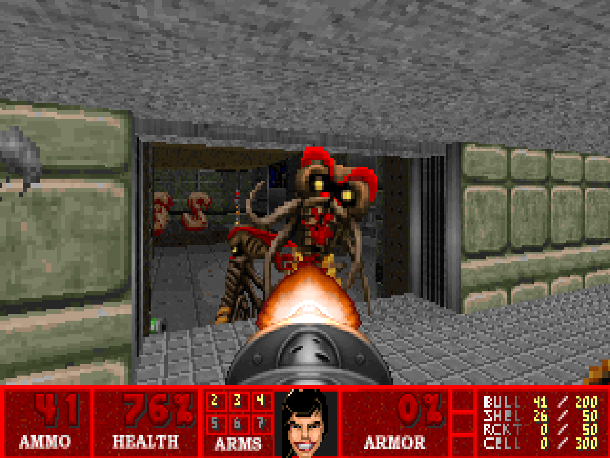

For mods designed for the original _Doom_ or _Ultimate Doom_, use Phase 1 (`lt1-1.iwad`); for others designed for _Doom 2_ or _Final Doom_, use Phase 2 (`lt1-2.iwad`).

If you're using the command line, use the `-file` parameter when you start the game. For example, to load the file `hr.wad`:

  crispy-doom -iwad lt1-2.iwad -file hr.wad

Some source ports also let you drag and drop the `.wad` file onto the source port icon in your file manager.

_[*Note for GZDoom users playing with mods:* If you need anything that has special lump filters that target Freedoom (but not LibTech1), you will need to rename the IWAD files to `freedoom1.wad` and `freedoom2.wad` as appropriate. A subfolder to keep these may be in order.]_

Any _Doom_ mod or map will load with LibTech1 and be playable, but anomalies do happen in unusual or specific situations:

* Your attacks become so _brutal_ your enemies turn into _Doom_ monsters when they die.

* An texture change marking a secret that is extremely subtle in Doom is now as visible as a regular door.

* "Welcome back, Corporal Taggart! The forces of hell..."

=== Finding custom content

You have over thirty years' worth of thousands of people's content to consider, so here's an arbitrary couple places to start:

* Doomworld's https://www.doomworld.com/10years/bestwads/[Top 100 WADs Of All Time] [sic] was written in 2003 and is still a great list of classic mods.

* For more recent and unorthodox content, Doomworld's annual https://www.doomworld.com/cacowards/[Cacowards] recognizes some of the best community releases in each past year.

* The Doom Wiki's https://doomwiki.org/wiki/List_of_notable_WADs[list of notable WADs] includes screenshots, map layouts and per-map statistics.

* Doomworld's interface to the idgames archive includes the ability to list the https://www.doomworld.com/idgames/index.php?top[top maps] based on five star rankings by visitors to the site.

<<<

== Meta

[[aboutfreedom]]
=== Freedoom is about freedom

When people hear about Freedoom, they often assume the name refers to price--that the only thing this project aims to do is to provide an alternative to _Doom_ that can be obtained without paying money. But this is not the case.

The word "free" has two different meanings in English. We say "free" to mean that something costs nothing, but we also use it to refer to freedom--like "free speech" or "the free press". Freedoom is about the latter. That might sound confusing. What does it mean?

Imagine a world where artists could only buy paints from a single company. A monopoly like that would mean paints would probably be more expensive, but the price wouldn't be the main concern. The bigger issue would be the power that it would grant to that company. The freedom of those artists to express themselves would depend on the company supplying them their paints.

For over 30 years now, the Doom modding community has produced thousands upon thousands of levels, mods and even entirely new games built upon the original _Doom_ games. These are works of art and ought to be recognised as such.
https://www.youtube.com/watch?v=KxYND6K6u8w[Doom is an art scene]. The raw material these works of art are made from is not paint or ink, but the original game itself--endlessly modified, reused and remixed into new variations.

The authors of _Doom,_ id Software, have historically been very generous to the Doom community. From the time of the game's release they went out of their way to share technical details with fans, and they later released _Doom's_ source code under a free software license--something that was unknown in the games industry at the time and should be commended. But despite this benevolence, they have always held a position of power. Today, rather than being a small independent studio, they and the Doom franchise are owned by a large multinational corporation.

Everybody deserves to be able to experience the wonder that is Doom and take part in its vibrant modding community that has endured for so many years. But that community also deserves its freedom and independence. By providing a free alternative that anyone can play, share, modify and reuse, we hope that's something that Freedoom can help to provide.

-- fraggle [https://soulsphere.org/]


[[whythisfork]]
=== Why this fork?

```
But in other cities there remains, in the center, the old narrow girdle of the walls from which the withered spires rise, the towers, the tiled roofs, the domes, while the new quarters sprawl around them like a loosened belt. Not Olinda: the old walls expand bearing the old quarters with them, enlarged but maintaining their proportions an a broader horizon at the edges of the city; they surround the slightly newer quarters, which also grew up on the margins and became thinner to make room for still more recent ones pressing from inside; and so, on and on, to the heart of the city, a totally new Olinda which, in its reduced dimensions retains the features and the flow of lymph of the first Olinda and of all the Olindas that have blossomed one from the other; and within this innermost circle there are always blossoming--though it is hard to discern them--the next Olinda and those that will grow after it.
```

When LibTech1 was first posted to Codeberg in October 2023, Freedoom was in its third decade of development, revision and renewal. Many people had left their mark on this project, a majority of which marks have been erased or moved to the https://github.com/freedoom/attic[attic] in favour of others. All maps and assets had completed content, and more entries are still being submitted; reasonable people involved in the project got into heated disputes over what should stay or go. The days of "Freedoom is in desperate need of assets; all contributions are welcome!" were over.

We were at a point in the project where people were proposing new assets not because the new ones were improvements but--and this is said with a straight face--because the current thing is "too old". Conversely, other proposed changes were vociferously rejected by others as deliberate regressions to earlier aesthetics. 2021-22 had seen a systematic removal of Freedoom's old 1990s dissonant hard rock musical style in favour of something much more modern and melodic--a change I personally welcomed, but https://github.com/freedoom/freedoom/issues/1361[still a clear departure from other visions for the project].

One source of disagreement is what Freedoom is even _for_. Should it be, first and foremost:

* an _archival tool_ for preserving _Doom_-based UGC, as compatible with such UGC as legally allowable with minimal additions otherwise?

* its own game, following faithfully the aesthetics and tropes that make Doom what it is?

* its own game, a straightforward fun fast-paced boomer shooter that follows the conventions of modern gaming?

* its own game that explores the sorts of innovations that made _Doom_ the bottled lightning that it had been in 1993?

Each of the above has its own vast range of possible, mutually incompatible implementations and combinations with the others. LibTech1 is but one attempt to continue one particular vision, which being a particular vision can only be so at the expense of many others. I hope to do things with this project that are simply impossible for a community project developed by informal committee.

Hopefully more forks will let the space for freedom of variety, expression and customization expand further.

My priorities for this fork are as follows:

* Same legal flexibility as Freedoom--BSD-3, no rips.

* Technical compatibility. Every PWAD made for one of the _Doom_ games should load and run in its intended source port, if not necessarily have everything in the right place.

* _Very approximate, utterly superficial_ aesthetic compatibility. Overall colours and materials more or less within similar ranges so custom maps running on LibTech1 _more or less_ look as intended--but anything that diegetically relies on the specific _Doom_ assets being what they are should be a secondary consideration at most.

* Diegetic elements may be of the same kind where it makes no honest sense to do otherwise. _Obvious:_ a weapon that fires bullets of limited power which main advantage is being small enough to sneak into situations where you lose all other weapons is going to be some sort of handgun, there's no real avoiding that. _Less obvious:_ many levels will have bloody sacrificial altars and temples and no gaming company has exclusive claim to fairly common religious symbols like the pentagram and the St. Peter's cross.

* That said, ideally aim for the same sort of newness that _Doom_ brought. It's hard to imagine now how radical a departure _Doom_ had been from the established gaming tropes of its time, when everything else now imitates _it_; I will never be able to replicate the fulness of that novelty, but there should be hints of it.

This list may be revisited from time to time.

-- apophis [https://sapronym.nfshost.com/]


==== Contributing to LibTech1

This being a personal project, I'm not looking for unsolicited content, but *bug* reports (visplane overflows, softlocks, graphical anomalies, accessibility regressions, replicating racist or ableist tropes, PWADs not loading, etc.) are always welcome.

If you'd like to contribute to Freedoom (or even suggest something from LT1 belongs upstream!), please check out its respository at https://github.com/freedoom/freedoom, the discussion forum at https://www.doomworld.com/forum/17-freedoom/, and the Discord guild at https://discord.gg/9DA3fut.


<<<

=== A plot

It doesn't matter who you are or what you did. Seven years ago you watched your public defender pull a cheap bottle of synthetic malt liquor out of her purse as she walked away, having just told you there was nothing in the budget for an appeal. They shipped you off to some foggy grey rock in the far reaches of human civilization, where you spent your days casting bullets for the army while watching the slow trickle of emails from your family go from monthly to holidays to every other big holiday and then finally none at all.

At least you had friends inside. And enemies. Convenient acquaintances and gullible guards. Your life had structure and routine. Stability. Security, even.

And then they sold the prison to AGM.

All the stuff they put in you was by consent, of course. Lots of rules under new management that you could easily get caught breaking; no one could blame you for getting them to cut down a couple weeks of solitary just by signing some documents and spending a few minutes in a lab each day. You'd sometimes overhear something about teleportation network optimization and xenobiotic ontology-ascendant polaric warp integration blahblahblah. Sometimes the treatments would cloud your thinking, or put you to sleep for who knows how long; the happy dreams were almost as numerous as the nightmares, so it all balanced out.

You watched the staff get more gullible, but meaner, because no one was never stationed there long enough to know anything anymore. They'd never notice when inmates went through dramatic personality changes, or would come back and something about their face wouldn't be quite right, or there'd just be an empty spot in the exercise yard one day and that was the end of it. There were the occasional muffled screams and explosions, but sometimes prison drama was like that.

The weird mind games only started later. They'd hook guys up to full-sensory AR headsets, give them a gun and lock them in a room with another inmate to see how long they lasted. Sometimes new rules would be added at random to make it easier or harder to pull the trigger. If the victim survived, they'd take the opportunity while patching them up to wire some new stuff into them, make them dumber and meaner--easier to control, in a way. After a few months it wasn't just the inmates this was happening to, but a few staff too--even senior staff, almost like everybody was being indoctrinated into doing this to themselves. Like it was a good thing.

You're not proud of the shots you took. They were all that you could do to survive.

Until one day when you woke up from one of your drug-infused blackouts surrounded by corpses with a gun in your hand, the interview room door blasted open and some disturbing, not-quite-sentient-sounding murmurs down the hall...
